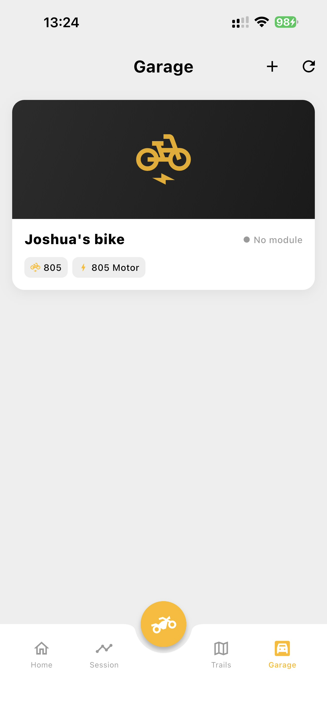
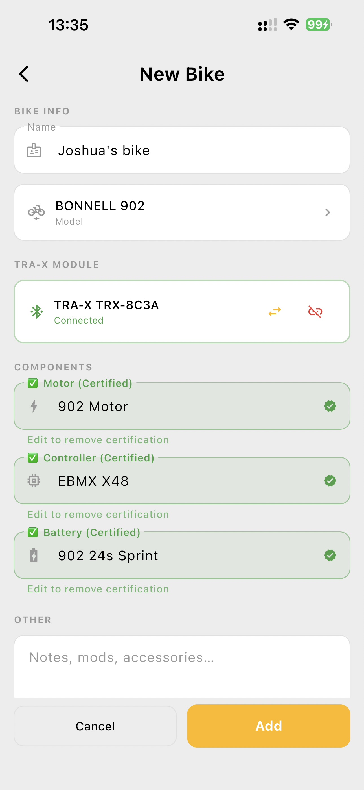
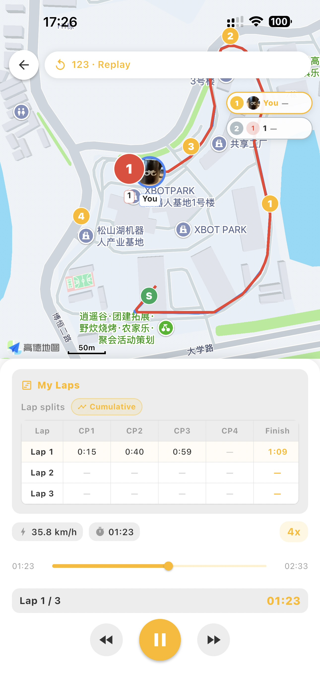
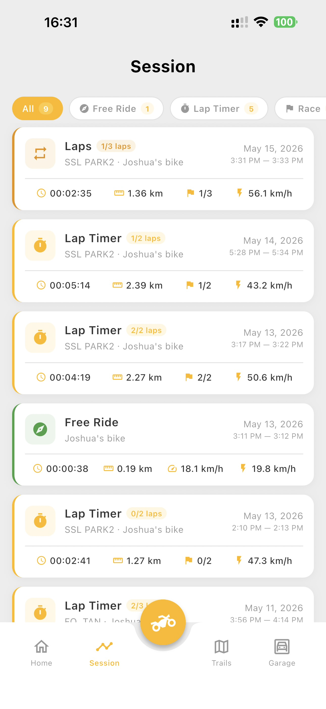

<!-- _class: cover -->

# TRAX App 功能概览
## Feature Overview

- 平台 / Platform：Flutter (iOS + Android)
- 地图栈 / Maps：Google Maps + 高德 AMap（按 GPS 自动切换 / region-aware）
- 后端 / Backend：Spring Boot 3 · JDK 21 · WebSocket · Bluetooth · MQTTS
- 坐标系 / Coords：WGS-84 ↔ GCJ-02（AMap 自动转换 / auto-converted）

---

<!-- _class: cover -->

## 目录 / Agenda

1. **Garage** — 车库与车辆档案 / Garage & bike profile
2. **Trail** — 赛道库与采集 / Trail library & recording
3. **Ride** — 骑行模式 / Ride modes
4. **Session** — 历史会话与回放 / Session history & replay

---

<!-- _class: cover -->

# 1. Garage 车库

车辆管理
Bike Management

---

## Garage · 主列表 / Main List

- **全部电单车 / Bike list**
  Lists all bikes owned by the user
- **车辆概览 / Bike summary**
  Custom name · brand + model · thumbnail
- **新增车辆 / Add bike**
    Add bike → TRAX module inquiry flow
- **管理车辆 / Manage bike**
    Manage bike profile

---

## Garage · 新增车辆流程 / Add-Bike Flow

- **TRAX 模块识别 / Module inquiry**
   Asks whether a TRAX smart module is installed
- **可用设备扫描 / Available device scan (BLE)**
   Lists nearby pairable hardware
- **车型选择器 / Model picker**
   Built-in brand library: BONNELL · E_Ride · RERODE · RISTRETTO · Sur-Ron · Talaria
- **零部件 / 规格编辑 / Parts & spec editor**
   Motor · controller · battery · tyres can be hand-tuned

---

## Garage · 车辆详情 / Bike Profile

- **Module 连接状态 / Connection Status**
TRAX module connection status

- **规格 / Specifications**
Motor · controller · battery, with "Certified" badge

- **统计 / Statistics**
Total Rides · Total Distance · Last Ride

- **管理 / Actions**
Ride history · Motor settings · Remove bike

---

<!-- _class: cover -->

# 2. Trail 赛道

公共赛道库 · 赛道录制 · 赛道管理
Public library · Trail recording · Trail management

---

## Trail · 列表页 / List

- **赛道库 / Trail library**
  Public trails + your own private trails
- **赛道卡片 / Trail card**
  Thumbnail · name · location · distance
- **Next steps**
  Personal lib
  Trails show on map

---

## Trail · 录制 / Recording

- **实时记录 / Ride recording**
  Live GPS polyline following your ride
- **实时记录(Lap) / Ride recording(Lap)**
  Live GPS polyline following your ride, auto finish when the trail is a lap
- **地图取点(Lap) / Pick points(Lap)**
  Pick points on the map to auto-organize a lap

---

## Trail · 详情 / Detail

- **路径信息 / Trail info**
  Auto-fits the whole route with chaser dot
  Custom start & finish markers
- **个性化检查点 / Personal checkpoints**
  Up to 4 per-user checkpoints per trail
- **Next steps**
  Ranking of the trail
  Upcoming events

---

<!-- _class: cover -->

# 3. Ride 骑行

六种模式 · 地图自适应 · 状态实时同步
Six modes · Region-aware maps · Realtime state sync

---

## Ride · 六大模式 / Six Modes

| # | 模式 / Mode | 说明 / Description                         | Single or Multiple|
|---|-------------|------------------------------------------|:------------:|
| 1 | Free Ride   | 自由骑 / Free ride with track & stats      |Single|
| 2 | Lap Timer   | 单人刷圈 / Solo lap practice               |Single|
| 3 | Host Laps   | 群组刷圈(按圈速) / Group lap timer challenge|Multiple|
| 4 | Host Race   | 群组比赛 / Group race challenge            |Multiple|
| 5 | Join Game   | 加入比赛 / Join an existing game           |Multiple|
| 6 | Watch Game  | 旁观直播 / Spectate live game              |Multiple|

---

## Ride · Free Ride

- **全屏地图 / Full-screen map**
  Full-screen map with heading marker
- **实时统计 / Live stats**
  Routes · Duration · Distance · Avg/Max Speed
- **控制条 / Controls**
  Start · Pause · Resume · Finish

---

## Ride · Lap Timer

- **路径选择 / Trail picker**
   Choose existing trail
- **设置CP / CP configuration**
   Add up to 4 checkpoints on the spot
- **计时页 / Timer page**
   - Timer starts when you cross the start point
   - Lap splits when crossing each checkpoint 
   - Lap finish when cross the start point 
   - Game finishes when the expected laps finish
- **活动汇总 / Event summary**

---

## Ride · Host Race / Host Laps

- **创建比赛 / Create Laps/Race**
  - 关联 trail（必选）/ Trail (required)
  - 公开 vs 仅邀请 / Public vs invite-only
  - 圈数 / Lap count
  - 计划开始时间 / Scheduled start time
- **邀请码 / Invitation code**
  Invite code generated for sharing

---

## Ride · Join Game

- **赛事列表 / Event list**
  Joinable public races/laps
- **邀请码加入 / Invitation code**
  Invitation code for private games
- **赛事详情 / Event detail**
  Trail preview, game type, participants, status
- **参赛或观看 / Join or Watch**
  You can either join the game or watch the game

---

## Ride · Race Tracking 比赛中

- **地图实时显示 / Map live show**
  Live map shows self + every opponent
- **聚焦骑手 / Focus**
  Hide/show any participants
- **实时排名 / Live ranking**
  Live ranking based on the position of each participant

---

## Ride · Laps Tracking 比赛中

- **地图实时显示 / Map live show**
  Live map shows self + every opponent
- **聚焦骑手 / Focus**
  Hide/show any participants
- **实时排名 / Live ranking**
  Live ranking based on the best lap time of each participant
- **圈数信息 / Laps info**
  My personal lap timer

---

## Ride · Watch Game 观赛

- **纯观众模式 / Spectator mode**
  Watch live positions & rankings of an ongoing game

---

## Ride · Race Replay 赛后回放

- **时间轴 / Scrubber**
  Timeline scrubber: seek + variable speed
- **赛后回放 / Replay**
  Replay the full game

---

<!-- _class: cover -->

# 4. Session 会话

个人骑行历史 · 多类型筛选 · 详情与回放
Personal ride history · Multi-type filter · Detail & replay

---

## Session · 列表 / List

- **骑行记录 / ride list**
  All rides of the current user
  Filter chips

---

## Session · Free ride Detail

- **地图轨迹 / Map polyline**
  Red polyline with start & finish point
- **数据卡 / Stats**：
  Riding info
- **回放与删除 / Replay & delete**
  Replay the full activity

---

## Session · Lap Timer Detail

- **地图轨迹 / Map polyline**
  Red polyline with start & finish point
- **数据卡 / Stats**：
  Riding info
- **圈数片段 / Lap splits**：
  Information of each lap with all checkpoints
  Best lap time
- **回放与删除 / Replay & delete**
  Replay the full activity

---

## Session · Race Detail

- **场地 / Trail**
  Trail of the event
- **比赛信息 / Race info**：
  Information of the event
- **冠军榜 / Leaderboard**：
  Final ranking of the whole event
  Final time & gap of each participant
- **圈数榜 / Lap board**：
  Position & Time of each lap for all participants
  Final time & gap of each participant
- **回放与删除 / Replay & delete**
  Replay the full activity

---

## Session · Laps Detail

- **场地 / Trail**
  Trail of the event
- **比赛信息 / Race info**：
  Information of the event
- **冠军榜 / Leaderboard**：
  Final ranking of the whole event
  Best time & diff of each participant
- **圈数片段 / My Laps**：
  Information of each lap with all checkpoints
  Best lap time
- **回放与删除 / Replay & delete**
  Replay the full activity

---

## 后续处理 / Next Steps

- Connect with trax express module
- Test the signal effect of module
- Professional statistics of bike using module data
- More fun ways to play
- UI/UX design
- Bugfix

---

<!-- _class: cover -->

# Thanks · 谢谢观看

**TRAX** — Garage · Trail · Ride · Session

构建一站式电单车骑行 · 训练 · 竞速体验
An all-in-one e-bike ride · training · racing experience
